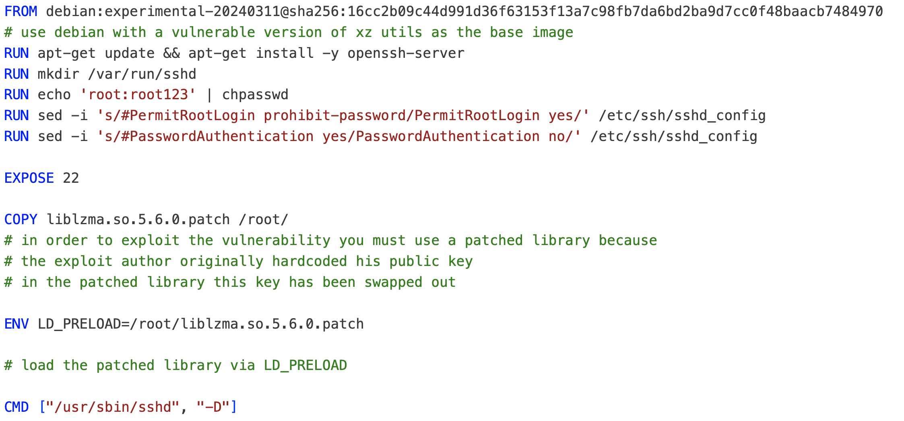
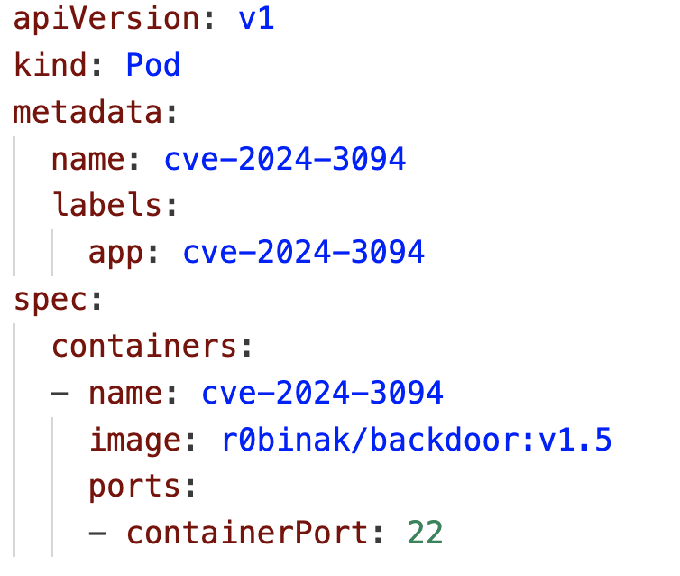
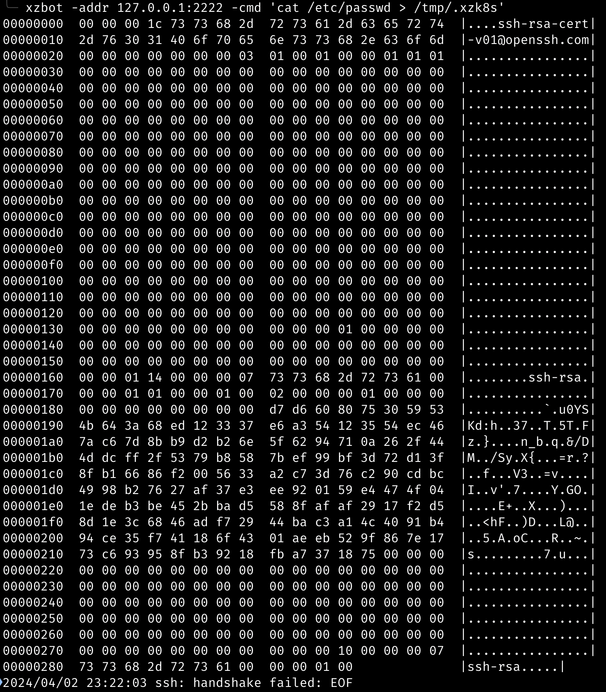
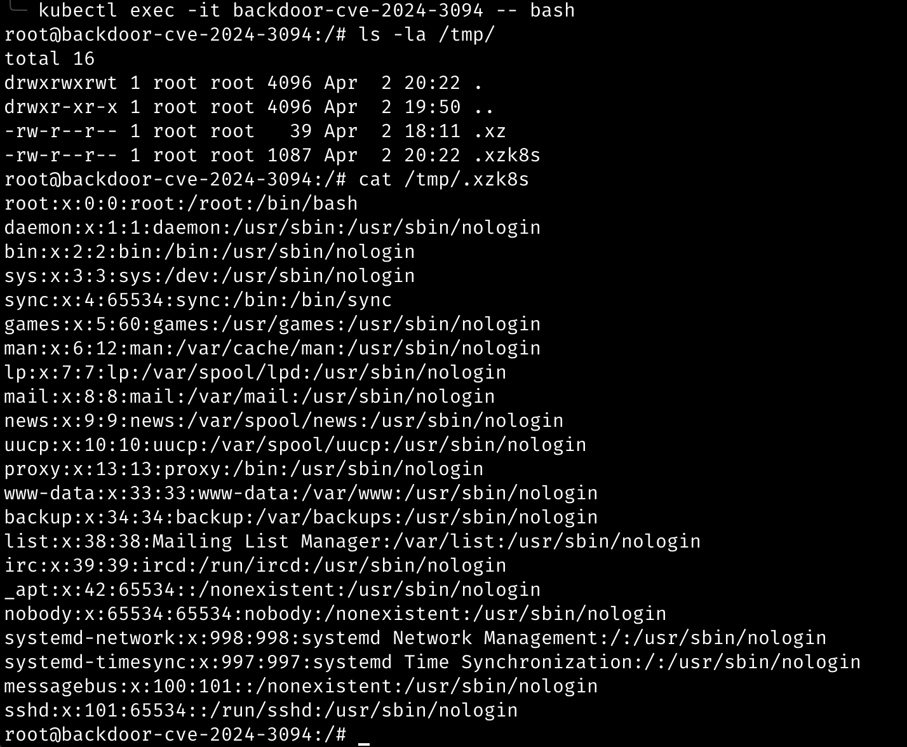

# xzk8s
Dockerfile and Kubernetes manifests for reproduce CVE-2024-3094

# Build image

We use the debian version of the vulnerable xz utils as the base image. We also need to patch the library. The patched version of the library is taken from the [xzbot repository](https://github.com/amlweems/xzbot/).



# Exploit demo

First, we must deploy a simple Pod, with the image assembled in the previous step.



Redirect the ports:

```bash
kubectl port-forward backdoor-cve-2024-3094 2222:22
```

Let's use the [xzbot](https://github.com/amlweems/xzbot/) exploit:



Finally, let's go inside the container and check the exploit results:



# References

- https://github.com/amlweems/xzbot/
- https://www.openwall.com/lists/oss-security/2024/03/29/4
- https://gist.github.com/smx-smx/a6112d54777845d389bd7126d6e9f504
- https://gist.github.com/q3k/af3d93b6a1f399de28fe194add452d01
- https://gist.github.com/keeganryan/a6c22e1045e67c17e88a606dfdf95ae4